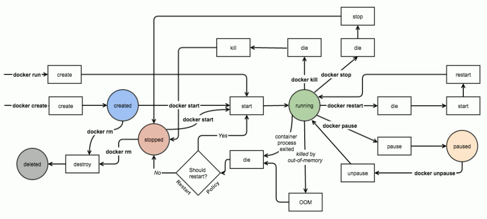

# 容器

容器是一种基础工具

## 容器种类

1. 主机级虚拟化
   - type-1:在软件之上建立一个完整的操作系统
   - type-2:

我们真正要使用的其实大部分是用户级进程，但是我们又不得不安装操作系统来提供支持

而且多级虚拟机会出现多次调度，浪费资源

2. 容器级虚拟化

docker是一种虚拟隔离环境，隔离用户空间

隔离后应该有的东西：

- /bin , /sbin根文件系统( Mount )
- 域名主机名等等( UTS )
- 能够容器内进行进程通信( ipc )
- 独立进程树( PID )
- 用户组隔离( user )
- port,ip独立，不同容器又可以主机通信( ip:port )

这些隔离环境通过名称空间实现( namespaces )，linux内核直接提供了，通过系统调用获得（clone(), setns()），但是提供支持的版本不同

==容器级虚拟化的缺点==：无法在一开始就限制内存，cpu等等

可以限制其使用过程中的获取，包括

1. 比例型分配
2. 上限型分配

由Control Groups提供

### Linux Container

通过lxc-create，在宿主机上面通过下载模板，在某个子目录下把这个目录作为根安装操作系统

问题：

1. 批量创建
2. 复制环境

### docker

docker用于简化lxc的操作，提供上面的问题解决方案。这是一个管理引擎

docker通过镜像技术

image（镜像文件）放在一个仓库中，当有人要创建容器时，可以在本地检查是否有镜像，有的话基于镜像启动容器，没有到仓库上面下载，然后基于镜像启动容器

为了便于管理，docker采用一个容器内只运行一个进程，如果有需要，则通过容器通信交互信息

docker使用分层构建，联合挂载

意思就是，对于一个centos上的tomcat和centos上的nginx，只需要一个centos镜像和tomcat镜像还有nginx镜像即可

如果tomcat需要定制centos，那么通过在tomcat和centos中添加中间配置来定制，镜像本身是只读的

docker可以提供外置型持久性存储，如果数据库挂了，可以重新在另一台上面开启，而文件仍然保存着

docker提供了容器编排工具

machine+swarm+compose：swarm是docker的工具，compose是单机编排工具

mesos+marathon：mesos同一资源分配工具

kubernetes：k8s

# docker基础用法

OCI：由linux基金会主导于2015年6月成立，旨在指定容器标准，包括

the Runtime Specification

the Image Specification

OCF：开放容器格式

runC：容器引擎

[hub.docker.com](hub.docker.com)这个docker的容器镜像网站

## 容器架构

这是一个c/s架构的程序


通过client，我们可以创建一个docker主机

通过上图右端的镜像仓库（默认是hub.docker.com），提供镜像

每个docker容器在创建时会创建一个可写层，来提供容器定制化的需求

---

所以我们知道

1. 有个镜像仓库
2. 本地存储了自己要用的镜像，下载协议是http或者https，默认是https
3. client端和docker_host也是通过https通信

---

docker--ee，docker--ce是docker的两个版本

### docker event state




### docker registry

1. 提供镜像仓库
2. 提供用户认证
3. 提供镜像搜索索引

一个仓库通常放一个程序的镜像们，即程序的多个版本，例如一个nginx程序一个仓库，但是里面有1.12,1.15等等不同的版本

通过tag（标签）来标识程序版本，例如nginx:1.10，这个一个镜像


一个镜像可以由多个标签

---

镜像是只读的，类似于程序。而容器则类似于进程，有生命周期

### docker objects

在docker中，images，containers，networks，volumes，plugins，还有其他的对象。都可以增删改查

### docker安装

#### 环境

1. 64 bits cpu
2. linux kernel 3.10+
3. linux kernel cgroups and namespaces

#### docker配置文件

##### 环境配置文件


##### Unit File

/usr/lib/systemd/system/docker.service

##### docker Registry 配置文件

/etc/containers/registries.conf

##### docker-ce

/etc/docker/daemon.json # 可以添加镜像加速

### docker镜像加速

1. ali云加速器
2. 中科大

在daemon.json中添加

```shell
{
stry-mirrors": ["http://hub-mirror.c.163.com"]
}
# /etc/docker/daemon.json
```

## docker命令

```shell
systemctl start docker.service # 启动容器
docker # 能够查看docker命令
# 为了兼容，docker有很多重复的命令
# docker分组命令，推荐使用这种方式
Management Commands:
  config      Manage Docker configs
  container   Manage containers
  image       Manage images
  network     Manage networks
  node        Manage Swarm nodes
  plugin      Manage plugins
  secret      Manage Docker secrets
  service     Manage services
  stack       Manage Docker stacks
  swarm       Manage Swarm
  system      Manage Docker
  trust       Manage trust on Docker images
  volume      Manage volumes
```

我的docker信息

```shell
[root@coblahouse yum.repos.d]# docker version
Client:# 作为客户端的版本
 Version:           18.06.1-ce# 版本号
 API version:       1.38# api版本
 Go version:        go1.10.3# go语言版本
 Git commit:        e68fc7a
 Built:             Tue Aug 21 17:23:03 2018
 OS/Arch:           linux/amd64# 适用系统linux/64位
 Experimental:      false

Server:# 作为服务器的半分
 Engine:
  Version:          18.06.1-ce
  API version:      1.38 (minimum version 1.12)
  Go version:       go1.10.3
  Git commit:       e68fc7a
  Built:            Tue Aug 21 17:25:29 2018
  OS/Arch:          linux/amd64
  Experimental:     false
```

查看更详细的信息

```shell
[root@coblahouse yum.repos.d]# docker info
Containers: 9# 容器个数
 Running: 0# 运行状态个数
 Paused: 0# 暂停
 Stopped: 9# 停止
Images: 3# 镜像个数
Server Version: 18.06.1-ce
Storage Driver: overlay2# 存储驱动
 Backing Filesystem: extfs
 Supports d_type: true
 Native Overlay Diff: true
Logging Driver: json-file
Cgroup Driver: cgroupfs
Plugins:# 插件
 Volume: local# 存储插件
 Network: bridge host macvlan null overlay
 Log: awslogs fluentd gcplogs gelf journald json-file logentries splunk syslog
Swarm: inactive
Runtimes: runc
Default Runtime: runc
Init Binary: docker-init
containerd version: 468a545b9edcd5932818eb9de8e72413e616e86e
runc version: 69663f0bd4b60df09991c08812a60108003fa340
init version: fec3683
Security Options:# 安全选项
 seccomp# 类似于selinux
  Profile: default
Kernel Version: 3.10.0-693.2.2.el7.x86_64# 内核版本
Operating System: CentOS Linux 7 (Core)
OSType: linux
Architecture: x86_64
CPUs: 1
Total Memory: 1.796GiB
Name: coblahouse
ID: JNIG:RCYH:FGY6:MG2J:RBR4:VSVF:F2P2:A6TU:Y2BV:7PDS:JKHI:J33W
Docker Root Dir: /var/lib/docker
Debug Mode (client): false
Debug Mode (server): false
Registry: https://index.docker.io/v1/
Labels:
Experimental: false
Insecure Registries:
 127.0.0.0/8
Live Restore Enabled: false
```

### docker常见操作

```shell
docker --help # 查看命令帮助
docker [Management Commands] --help # 查看指定管理块命令帮助
# for example
docker image --help
docker [Management Commands] [Commands] --help # 查看指定命令帮助
```


```shell
# 下面三个都可以使用 docker container command 来代替
docker search: search images
docker pull: pull an image
docker images: list images
```
#### 镜像相关
##### docker 搜索镜像

```shell
[root@coblahouse yum.repos.d]# docker search nginx
```

| name                                         | description              | stars | official | automated |
| -------------------------------------------- | ------------------------ | ----- | -------- | --------- |
| nginx                                        | Official build of Nginx. | 9795  | [OK]     | [OK]/     |
| jwilder/nginx-proxy（jwilder这个用户的镜像） |                          |       |          |           |
| 镜像名                                       | 描述                     | 星数  |          |           |

但是我们最好还是取web页面检索一下

1. 搜索镜像 
2. 点击tag 
3. 下载一个版本，这里用于演示下载alpine版本

```shell
[root@coblahouse yum.repos.d]# docker image pull nginx:1.14-alpine
# 这里注意版本对应问题
```
alpine是一个小型版本，但是缺乏调试工具等等，多数时候我们需要定制一个自己的，同时建立私有仓库
##### 显示image

```shell
[root@coblahouse ~]# docker image list
REPOSITORY          TAG                 IMAGE ID            CREATED             SIZE
nginx               1.14-alpine         14d4a58e0d2e        3 weeks ago         17.4MB
```

**busybox**：链接一个程序，那么就具有这个程序的功能

下载busybox

```shell
[root@coblahouse ~]# docker image pull busybox
Using default tag: latest
latest: Pulling from library/busybox
90e01955edcd: Pull complete 
Digest: sha256:2a03a6059f21e150ae84b0973863609494aad70f0a80eaeb64bddd8d92465812
Status: Downloaded newer image for busybox:latest

[root@coblahouse ~]# docker image ls --no-trunc # IMAGE ID 完整格式
REPOSITORY          TAG                 IMAGE ID                                                                  CREATED             SIZE
busybox             latest              sha256:59788edf1f3e78cd0ebe6ce1446e9d10788225db3dedcfd1a59f764bad2b2690   3 days ago          1.15MB
nginx               1.14-alpine         sha256:14d4a58e0d2e63431ccac050e4294bd92df76aba8864f5f201ee293797febf79   3 weeks ago         17.4MB
```

##### 删除镜像

```shell
docker image rm
docker rmi
```

#### 容器相关

```shell
docker ps # 查看容器信息
docker container ls # 同上，一样作用的指令
docker run # 创建一个镜像，默认启动容器自身的命令，也可以自定义
```

默认启动一个container时是使用bridge网络连接的

##### 启动busybox


```shell
# 启动一个busybox
[root@coblahouse ~]# docker run --name b1 -it busybox:lastest # lastest可以不加版本号，--name 设置名字 -it交互式

# 进入busybox界面

/ # ps
PID   USER     TIME  COMMAND
    1 root      0:00 sh
    6 root      0:00 ps
# 在docker中pid为1的就是总管进程
# 在busybox下创建一个http服务

/ # ps
PID   USER     TIME  COMMAND
    1 root      0:00 sh
    6 root      0:00 ps
/ # ls /
bin   dev   etc   home  proc  root  sys   tmp   usr   var
/ # mkdir /data/html -p

/ # ls
bin   data  dev   etc   home  proc  root  sys   tmp   usr   var

/ # vi /data/html/index.html

/ # httpd -h
httpd: option requires an argument -- h
BusyBox v1.29.3 (2018-10-01 22:37:18 UTC) multi-call binary.

Usage: httpd [-ifv[v]] [-c CONFFILE] [-p [IP:]PORT] [-u USER[:GRP]] [-r REALM] [-h HOME]
or httpd -d/-e/-m STRING

Listen for incoming HTTP requests

        -i              Inetd mode
        -f              Don't daemonize
        -v[v]           Verbose
        -p [IP:]PORT    Bind to IP:PORT (default *:80)
        -u USER[:GRP]   Set uid/gid after binding to port
        -r REALM        Authentication Realm for Basic Authentication
        -h HOME         Home directory (default .)
        -c FILE         Configuration file (default {/etc,HOME}/httpd.conf)
        -m STRING       MD5 crypt STRING
        -e STRING       HTML encode STRING
        -d STRING       URL decode STRING

/ # httpd -f -h /data/html

# 启动成功，在docker中查看b1 container

[cobla@coblahouse ~]$ sudo docker ps
CONTAINER ID        IMAGE               COMMAND             CREATED             STATUS              PORTS               NAMES
6585adc60f21        busybox             "sh"                               10 minutes ago       Up 10 minutes            b1

[cobla@coblahouse ~]$ sudo docker inspect b1 # 底下存在这么一行
"NetworkSettings": {
	"IPAddress": "172.17.0.2"
# 我们用curl 爬取一下页面内容
[cobla@coblahouse ~]$ curl 172.17.0.2
BusyBox Server.# 成功，这相当于两个虚拟机在交互

# 退出程序与退出busybox
[cobla@coblahouse ~]$ sudo docker ps
NAMES b1# 退出程序，可以看到由于开启了交互式，容器仍然存在（pid=1的进程没死）
/ # exit # 退出了
[root@coblahouse ~]# docker ps
NAMES # 空了，因为pid=1的shell已经不存在了
# 更换其他指令查看
[root@coblahouse ~]# docker container ls
NAMES # 查不到
[root@coblahouse ~]# docker container ls -a
CONTAINER ID        IMAGE               COMMAND             CREATED             STATUS                            PORTS               NAMES
6585adc60f21        busybox             "sh"                18 minutes ago      Exited (130) About a minute ago                       b1 # 查到了，上面的exited显示这是一个已经退出的docker
```

##### 重新启动

```shell
# 重新启动一个容器
docker start --help

Usage:  docker start [OPTIONS] CONTAINER [CONTAINER...]

Start one or more stopped containers

Options:
  -a, --attach               Attach STDOUT/STDERR and forward signals
      --detach-keys string   Override the key sequence for detaching a container
  -i, --interactive          Attach container's STDIN
# 如果启动是nginx守护进程，直接start container name即可
# 这里是交互式加上-ai
[root@coblahouse ~]# docker start -ai b1
/ # 
```

##### 终止删除

```shell
# 终止容器
[cobla@coblahouse ~]$ sudo docker kill b1
# 可以在容器运行的时候强制终止，但是容易丢失数据
b1 # 终止后显示这个
#---------交互式启动者的退出容器
/ # [root@coblahouse ~]# 

# 删除容器
# [root@coblahouse ~]# docker rm b1
b1
[root@coblahouse ~]# docker container ls -a
CONTAINER ID        IMAGE               COMMAND             CREATED             STATUS              PORTS               NAMES
```

##### 启动nginx

```shell
# 启动nginx镜像
[root@coblahouse ~]# docker run --name nginx_name -d nginx:1.14-alpine 
# -d 后台容器
edee4b06b450be48d266e9e492402409beae08717f7016daff04859683b26143
[root@coblahouse ~]# docker ps
COMMAND "nginx -g 'daemon of…"
# 这里注意，对于一个容器来说，一定不要在后台运行，因为在容器里面只有一个进程，如果到后台，那么这个容器就没有启动的必要了，会被关闭
# 这里daemon of ... 是用于让这个进程不会进入后台而设置的命令

# 查看nginx启动的ip
[root@coblahouse ~]# docker inspect nginx_name
"IPAddress": "172.17.0.2" # 显示了这个nginx的地址
[cobla@coblahouse ~]$ curl 172.17.0.2 # 访问nginx
<title>Welcome to nginx!</title> # 返回信息
```

##### 启动redis

```shell
# 启动一个redis容器，默认没有下载
[root@coblahouse ~]# docker run --name kvredis -d redis:4-alpine
# 先查看镜像是否下载
[root@coblahouse ~]# docker image ls
REPOSITORY          TAG                 IMAGE ID            CREATED             SIZE
redis               4-alpine            05097a3a0549        3 days ago          30MB
# 查看容器是否启动
[root@coblahouse ~]# docker ps |grep kvredis
239d386e9b60        redis:4-alpine      "docker-entrypoint.s…"   About a minute ago   Up About a minute   6379/tcp            kvredis
```
##### exec执行容器内部命令
```shell
# 在容器内执行命令，通过exec
[root@coblahouse ~]# docker container --help|grep exec
  exec        Run a command in a running container
[root@coblahouse ~]# docker container exec --help     

Usage:  docker container exec [OPTIONS] CONTAINER COMMAND [ARG...]

Run a command in a running container

Options:
  -d, --detach               Detached mode: run command in the background
      --detach-keys string   Override the key sequence for detaching a container
  -e, --env list             Set environment variables
  -i, --interactive          Keep STDIN open even if not attached
      --privileged           Give extended privileges to the command
  -t, --tty                  Allocate a pseudo-TTY
  -u, --user string          Username or UID (format: <name|uid>[:<group|gid>])
  -w, --workdir string       Working directory inside the container
# 必须要一个 container 和 command，这里运行一个shell，必须要交互方式，所以加上参数-it
[root@coblahouse ~]# docker exec -it kvredis /bin/sh 
/data # ps
PID   USER     TIME  COMMAND
    1 redis     0:00 redis-server
   12 root      0:00 /bin/sh
   17 root      0:00 ps
# 这种方式可以探测容器的运行
/data # netstat -tnl # 监测一下redis是否在6379端口
Active Internet connections (only servers)
Proto Recv-Q Send-Q Local Address           Foreign Address         State       
tcp        0      0 0.0.0.0:6379            0.0.0.0:*               LISTEN      
tcp        0      0 :::6379                 :::*                    LISTEN      
/data # redis-cli # 访问redis
127.0.0.1:6379> LSET al 1 2
(error) ERR no such key
127.0.0.1:6379> LPUSH att 12
(integer) 1
127.0.0.1:6379> LPOP att
"12"
```

##### 常用日志获取方式

```shell
# 对于一个容器来说，因为默认只有一个进程运行，比如nginx，那么就没有必要把日志保存在文件中
# docker提供了logs命令来获取一个容器在控制台上面输出的内容
[root@coblahouse ~]# docker container --help|grep logs
  logs        Fetch the logs of a container
[root@coblahouse ~]# docker container logs nginx_name # 获取nginx的logs
172.17.0.1 - - [06/Oct/2018:06:39:56 +0000] "GET / HTTP/1.1" 200 612 "-" "curl/7.60.0" "-"
```


#### 网络相关

```shell
docker network # 查看网络
```

## docker常见错误

```shell
# 如果systeml stop docker后无法启动，可以删除/var/lib/docker目录，因为里面保存着之前的docker使用情况
rm -rf /var/lib/docker
```

