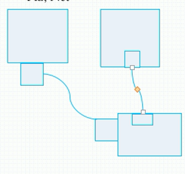
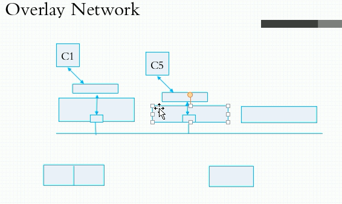
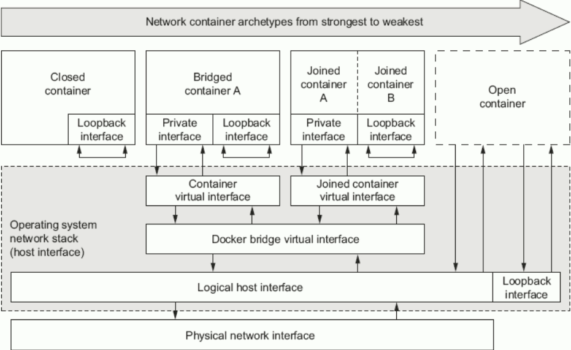

# 1.linux下的6中名称空间

- UTS
- User
- Mount
- IPC
- Pid
- Net

我们需要让容器在外层通信

linux原生支持网络二层软件设计，依靠软件实现交换机能力，所以我们将一半放在容器，一半放在主机，就可以实现外部访问容器的能力



只要网卡配置的网络地址在同一个网段，则可以直接通信

# 2.叠加网络overlay network



C1与C5通信时，C1的报文目标地址就是C5的目标地址，而C1的主机会在上面封装一层自己的IP地址，目标地址是C5主机的IP地址，这种三层网络二次封装的办法就是隧道转发，好处是C1直接看到了C5，但是又不会由于大家都在一个网段内而造成广播风暴

# 3.docker的网络

```shell
[cobla@coblahouse ~]$ sudo docker network ls
NETWORK ID          NAME                DRIVER              SCOPE
2c2cb0a994c6        bridge              bridge              local
431f030ab8a7        host                host                local
974380bf2555        none                null                local
```

使用docker network ls可以查看docker的网络，其中有一个bridge网络，这是一个软件实现的桥，在本机之上自动创建了一个虚拟交换机，如果给予地址那么就可以当网卡使用

每当创建一个docker容器时，那么就可以分配一对网卡设备（虚拟），一半在容器上，一半在docker0这个桥上

下面看看docker的bridge，docker0

```shell
[cobla@coblahouse ~]$ ifconfig 
docker0: flags=4163<UP,BROADCAST,RUNNING,MULTICAST>  mtu 1500
        inet 172.17.0.1  netmask 255.255.0.0  broadcast 172.17.255.255
        ether 02:42:d7:8d:0d:3b  txqueuelen 0  (Ethernet)
        RX packets 18  bytes 1850 (1.8 KiB)
        RX errors 0  dropped 0  overruns 0  frame 0
        TX packets 20  bytes 1348 (1.3 KiB)
        TX errors 0  dropped 0 overruns 0  carrier 0  collisions 0
```

docker0的自身地址是127.17.0.1

下面查看一下在宿主机之上的那一半网卡

```shell
vethca5c00d: flags=4163<UP,BROADCAST,RUNNING,MULTICAST>  mtu 1500
        ether 8e:d4:bd:14:43:7d  txqueuelen 0  (Ethernet)
        RX packets 0  bytes 0 (0.0 B)
        RX errors 0  dropped 0  overruns 0  frame 0
        TX packets 0  bytes 0 (0.0 B)
        TX errors 0  dropped 0 overruns 0  carrier 0  collisions 0
```

而我们只有一个docker容器

```shell
[cobla@coblahouse ~]$ sudo docker ps
CONTAINER ID        IMAGE               COMMAND                  CREATED             STATUS              PORTS               NAMES
a5c0580ce8c9        redis:4-alpine      "docker-entrypoint.s…"   3 days ago          Up 3 days           6379/tcp            redis123
```

那么这个docker容器是如何挂接到docker0上面的呢

## 3.1安装并使用bridge-utils

```shell
# 安装bridge-uitls
yum -y install bridge-utils
# 查看程序安装位置
whereis brctl
[cobla@coblahouse ~]$ whereis brctl
brctl: /usr/sbin/brctl /usr/share/man/man8/brctl.8.gz
# 使用brctl查看bridge
[cobla@coblahouse ~]$ brctl show docker0
bridge name     bridge id               STP enabled     interfaces
docker0         8000.0242d78d0d3b       no              vethca5c00d
```

可以看到vethca5c00d在docker0上面挂载了

```shell
# 使用ip link show查看网卡信息，能看到另一半的信息
vethca5c00d@if40# 另一半就是if40，挂在docker容器内部
```

## 3.2进入vethca5c00d查看软网卡信息

```shell
/data # ifconfig 
eth0      Link encap:Ethernet  HWaddr 02:42:AC:11:00:02  
          inet addr:172.17.0.2  Bcast:172.17.255.255  Mask:255.255.0.0
          UP BROADCAST RUNNING MULTICAST  MTU:1500  Metric:1
          RX packets:0 errors:0 dropped:0 overruns:0 frame:0
          TX packets:0 errors:0 dropped:0 overruns:0 carrier:0
          collisions:0 txqueuelen:0 
          RX bytes:0 (0.0 B)  TX bytes:0 (0.0 B)
```

因为容器和docker0在同一个桥上，所以我们就可以ping一下docker0

```shell
/data # ping 127.0.0.1
PING 127.0.0.1 (127.0.0.1): 56 data bytes
64 bytes from 127.0.0.1: seq=0 ttl=64 time=0.061 ms
64 bytes from 127.0.0.1: seq=1 ttl=64 time=0.067 ms
64 bytes from 127.0.0.1: seq=2 ttl=64 time=0.052 ms
64 bytes from 127.0.0.1: seq=3 ttl=64 time=0.070 ms
^C
--- 127.0.0.1 ping statistics ---
4 packets transmitted, 4 packets received, 0% packet loss
round-trip min/avg/max = 0.052/0.062/0.070 ms
# 网络良好，嘻嘻
```

## 3.3docker的报文封装

由于docker使用nat转发方式，因此容器会进行报文封装，我们可以使用iptables查看

```shell
[cobla@coblahouse ~]$ iptables -t nat -vnL
Chain POSTROUTING (policy ACCEPT 30210 packets, 2007K bytes)
 pkts bytes target     prot opt in     out     source               destination         
    0     0 MASQUERADE  all  --  *      !docker0  172.17.0.0/16        0.0.0.0/0 
```

**解析意思**

in *：从任何入口进来的数据包，只要out不是docker0（out !docker0），并且源主机是172.0.0.0/16网段上的主机，目标主机是0.0.0.0/0即任何主机，那么都要进行MASQUERADE，也就是地址伪装

因为容器从docker0桥出去要进行地址伪装，所以认为docker0桥是一个nat桥

## 3.4docker容器通信方式分类

### 3.4.1本机容器之间互相访问

由于两个容器都通过同一个桥连接在一个网段内，而在同一个网段的主机可直接通信，因此同一个台主机的容器之间可以直接通信

**示例**

1. 开启两个容器

```shell
[root@coblahouse ~]# docker container ls
CONTAINER ID        IMAGE               COMMAND                  CREATED             STATUS              PORTS               NAMES
80cd76d78119        nginx:1.14-alpine   "nginx -g 'daemon of…"   7 minutes ago       Up 7 minutes        80/tcp              nignx1
a5c0580ce8c9        redis:4-alpine      "docker-entrypoint.s…"   3 days ago          Up 3 days           6379/tcp            redis123
```

2. 我们用redis123访问nignx1，首先查看nignx1的端口号和ip地址

```shell
[cobla@coblahouse ~]$ sudo docker container exec nignx1 netstat -tnl        
Active Internet connections (only servers)
Proto Recv-Q Send-Q Local Address           Foreign Address         State       
tcp        0      0 0.0.0.0:80              0.0.0.0:*               LISTEN      
[cobla@coblahouse ~]$ sudo docker container exec nignx1 ifconfig    
eth0      Link encap:Ethernet  HWaddr 02:42:AC:11:00:03  
          inet addr:172.17.0.3  Bcast:172.17.255.255  Mask:255.255.0.0
          UP BROADCAST RUNNING MULTICAST  MTU:1500  Metric:1
          RX packets:1 errors:0 dropped:0 overruns:0 frame:0
          TX packets:0 errors:0 dropped:0 overruns:0 carrier:0
          collisions:0 txqueuelen:0 
          RX bytes:42 (42.0 B)  TX bytes:0 (0.0 B)

lo        Link encap:Local Loopback  
          inet addr:127.0.0.1  Mask:255.0.0.0
          UP LOOPBACK RUNNING  MTU:65536  Metric:1
          RX packets:0 errors:0 dropped:0 overruns:0 frame:0
          TX packets:0 errors:0 dropped:0 overruns:0 carrier:0
          collisions:0 txqueuelen:1 
          RX bytes:0 (0.0 B)  TX bytes:0 (0.0 B)
```

nignx1监听的是80端口，ip是172.17.0.3，因此访问nignx服务的地址就是http://172.17.0.3:80

3. 登录redis123，并访问nignx1的nignx服务

```shell
[root@coblahouse ~]# docker container exec -it redis123 /bin/sh
/data # wget -O - -q http://172.17.0.3:80
<!DOCTYPE html>
<html>
<head>
<title>Welcome to nginx!</title>
```

==访问成功！！！==

说明一下，wget -O - 是直接输出到桌面上的意思 - 代表桌面，-O代表不保存

### 3.4.2本机访问本机的容器

本身本机无法访问本机的容器，因为不在一个网段上面，但是因为本机将docker的软交换机当做网卡使用，当找不到主机时会转发请求，docker的软网卡接收到请求后转发到容器，因此对于本机来说就像是访问同一网段内的主机一样

```shell
# 查看redis123的地址和端口
[cobla@coblahouse ~]$ sudo docker container exec redis123 netstat -tnl
Active Internet connections (only servers)
Proto Recv-Q Send-Q Local Address           Foreign Address         State       
tcp        0      0 0.0.0.0:6379            0.0.0.0:*               LISTEN      
tcp        0      0 :::6379                 :::*                    LISTEN      
[cobla@coblahouse ~]$ sudo docker container exec redis123 ifconfig    
eth0      Link encap:Ethernet  HWaddr 02:42:AC:11:00:02  
          inet addr:172.17.0.2  Bcast:172.17.255.255  Mask:255.255.0.0
          UP BROADCAST RUNNING MULTICAST  MTU:1500  Metric:1
          RX packets:10 errors:0 dropped:0 overruns:0 frame:0
          TX packets:18 errors:0 dropped:0 overruns:0 carrier:0
          collisions:0 txqueuelen:0 
          RX bytes:1417 (1.3 KiB)  TX bytes:1240 (1.2 KiB)

lo        Link encap:Local Loopback  
          inet addr:127.0.0.1  Mask:255.0.0.0
          UP LOOPBACK RUNNING  MTU:65536  Metric:1
          RX packets:8 errors:0 dropped:0 overruns:0 frame:0
          TX packets:8 errors:0 dropped:0 overruns:0 carrier:0
          collisions:0 txqueuelen:1 
          RX bytes:672 (672.0 B)  TX bytes:672 (672.0 B)
```

```shell
# 查看redis命令，使用远程访问方式
[cobla@coblahouse ~]$ redis-cli --help
  -h <hostname>      Server hostname (default: 127.0.0.1).
  -p <port>          Server port (default: 6379).
# 访问redis123的redis服务
# redis123的ip为172.17.0.2，port为6379，是默认值，因此执行指令如下
[cobla@coblahouse ~]$ redis-cli -h 172.17.0.2 
172.17.0.2:6379> 
# 成功访问redis服务
```

## 3.5docker的4种网络接口



```shell
[cobla@coblahouse ~]$ sudo docker network ls

NETWORK ID          NAME                DRIVER              SCOPE
2c2cb0a994c6        bridge              bridge              local
431f030ab8a7        host                host                local
974380bf2555        none                null                local
```

docker一共有三种网络方式，第一种是3.4中的桥接方式，第二种是与宿主机共享UTS，IPC，NET这三种通信相关的名称空间的方式，最后一种是只有环回地址的方式（无法联网）

1. closed container 封闭式网络，对应name为none的方式
2. bridged contatiner A 桥接网络
3. joined containerA B docker容器之间共享通信相关的名称空间的方式
4. open container 开放式网络，直接与主机共享通信相关的名称空间

创建时默认为nat桥网络，第二种网络bridge container

于是我们可以在创建容器时指定容器的网络

1. 查看docker的bridge的设定

```shell
# 查看bridge网络的详细信息
[cobla@coblahouse ~]$ sudo docker network inspect bridge
"Config": [
                {
                    "Subnet": "172.17.0.0/16",
                    "Gateway": "172.17.0.1"
                }
            ]
"com.docker.network.bridge.name": "docker0",
# 可以看到docker bridge的名称叫docker0，同时使用的是172.17.0.0/16网段
```

2. 查看容器的网络设定

```shell
[cobla@coblahouse ~]$ sudo docker container inspect redis123
"Networks": {
  "bridge": {
    "IPAMConfig": null,
    "Links": null,
    "Aliases": null,
    "NetworkID": "2c2cb0a994c6e2fa06f8001a373eea7d5347d9883168cb66678341714aa12000",
    "EndpointID": "c85be3dcc8d5daf6a2156597361b594440b141f149362d1991e1473d5acebdbd",
    "Gateway": "172.17.0.1",
    "IPAddress": "172.17.0.2",
    "IPPrefixLen": 16,
    "IPv6Gateway": "",
    "GlobalIPv6Address": "",
    "GlobalIPv6PrefixLen": 0,
    "MacAddress": "02:42:ac:11:00:02",
    "DriverOpts": null
  }
}
```

