# 1.镜像关系

- 网上有registry，存储这大量的镜像，其中dockerhub是最知名的
- 本地有下载好的镜像
- 镜像依靠特殊的文件系统，如overlay2

镜像之中含有启动容器所需要的文件系统及其内容

可以验证

```shell
[cobla@coblahouse ~]$ sudo docker container exec -it a5c0580ce8c9 /bin/sh  
/data # ls
dump.rdb
/data # hostname
a5c0580ce8c9
/data # ps -ef
PID   USER     TIME  COMMAND
    1 redis     0:00 redis-server
   17 root      0:00 /bin/sh
   24 root      0:00 ps -ef
```

redis的镜像提供了sh，显然应该是容器提供的

# 2.docker容器层次

docker提供了分层构建机制，大体两部分，最底层为bootfs引导文件系统，顶层用来运行镜像的是rootfs

bootfs：用于系统引导的文件系统，包括bootload和kernel，容器启动后会被卸载，用于节约内存资源

rootfs：表现为容器的根文件系统

# 3.Docker Registry

启动容器时，docker daemon会试图从本地获取相关的镜像，如果不存在，则从registry获取

默认docker hub

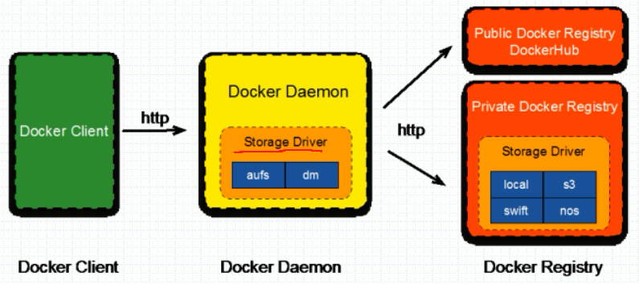

**harbor**，一个很重要的docker registry

## 3.1docker registry分类


**Repository**

repository是由某特定的docker镜像的所有迭代版本组成的镜像仓库，一个仓库包含多个镜像，tag（多对一）镜像

repository分为用户仓库和顶层仓库，用户仓库名称格式为用户名/仓库名

**index**

- 维护用户账户，镜像校验以及公共命名空间的信息
- 相当于为Registry提供了一个完成用户认证等功能的检索接口

## 3.2docker registry的发布流程

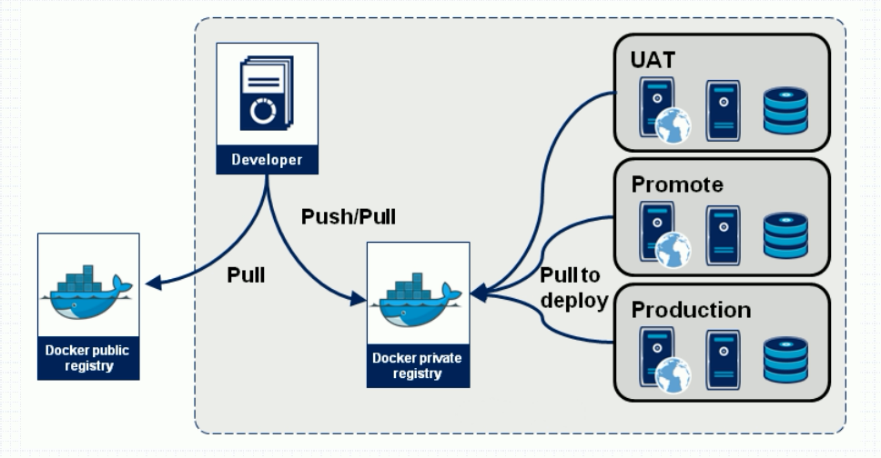

1. developer制作镜像（写程序）
2. pull/push到docker private registry
3. 私服上再根据应用情况发布到对应的线上，注意，三个不同的位置可能镜像的具体配置有一些不同

## 3.3Docker Hub

- <font color='red'>Image Repositories</font>：镜像仓库，可以注册账号，在自己的用户空间做仓库
- Automated Builds：自动构建镜像，当你的source库改变时，增加了一个dockerfile文件，docker hub会监听库的变化，生成image
- webhooks：用于自动构建时配置source库所用
- organizations：创建一个工作组，用于镜像仓库的控制访问
- github and bitbucker integration：添加hub和你的docker images 到你的当前工作空间

# 4.docker images 管理指令

## 4.1拉取镜像pull

**拉取镜像**

```shell
[cobla@coblahouse ~]$ sudo docker pull --help

Usage:  docker pull [OPTIONS] NAME[:TAG|@DIGEST]

Pull an image or a repository from a registry

docker pull <registry>[:<port>]/[<namespace>/]<name>:<tag>
```

namespace

- organization 某个组织
- login（user name）某个用户
- role 角色，开发测试等等

## 4.2制作镜像，commit

- dockerfile

使用==build==命令来制作

- 基于容器制作

使用commit，将容器的最上面的可写层制作成镜像

- 使用docker hub automated builds，自动制作成镜像

### 4.2.1制作基于busybox的镜像

```shell
# 首先，制作一个带index.html文件的busybox，退出
# 这时容器是处于exited的状态的
# 使用commit命令制作，需要注意的是，如果制作时容器在运行中，镜像容易产生一些输出一半的文件，因此需要关闭容器或者使用 -p参数
CONTAINER ID        IMAGE               COMMAND                  CREATED             STATUS                          PORTS               NAMES
8d657032396a        busybox             "/bin/sh"                3 minutes ago       Exited (0) About a minute ago                       b1
# 这里b1是容器的names属性
[cobla@coblahouse ~]$ sudo docker commit b1
sha256:b90939e5aceda7cdca1d7f49efd57a43fd6b018bba52ea0509b192c8b52835fb
```

```shell
[cobla@coblahouse ~]$ sudo docker image ls
REPOSITORY          TAG                 IMAGE ID            CREATED              SIZE
<none>              <none>              b90939e5aced        About a minute ago   1.15MB
```

==补充，可以使用docker tag 命令给镜像设置标签==

```shell
[cobla@coblahouse ~]$ sudo docker tag --help

Usage:  docker tag SOURCE_IMAGE[:TAG] TARGET_IMAGE[:TAG]

Create a tag TARGET_IMAGE that refers to SOURCE_IMAGE
```

```shell
Create a tag TARGET_IMAGE that refers to SOURCE_IMAGE
[cobla@coblahouse ~]$ sudo docker tag b90939e5aced cobla/bus_info:v0.0.1-1
[cobla@coblahouse ~]$ sudo docker image ls
REPOSITORY          TAG                 IMAGE ID            CREATED             SIZE
cobla/bus_info      v0.0.1-1            b90939e5aced        10 minutes ago      1.15MB
redis               4-alpine            05097a3a0549        2 weeks ago         30MB
busybox             latest              59788edf1f3e        2 weeks ago         1.15MB
nginx               1.14-alpine         14d4a58e0d2e        5 weeks ago         17.4MB
```

**说明**

- 没有repostory和tag，所以只能用image id
- cobla是假定我们在docker hub上面有个用户叫cobla（之前说的个人用户的仓库），所以就有一个叫cobla的用户仓库
- 仓库中有一个bus_info镜像
- 设置其tag为v0.0.1-1

需要注意的是，一个镜像可以打多个标签，当删除一个标签时不会删除image，而是去除标签

**视察镜像参数**

我们可以使用inspect视察镜像的参数，比如镜像默认启动的cmd

```shell
# inspect usage
[cobla@coblahouse ~]$ sudo docker inspect --help

Usage:  docker inspect [OPTIONS] NAME|ID [NAME|ID...]

Return low-level information on Docker objects

Options:
  -f, --format string   Format the output using the given Go template
  -s, --size            Display total file sizes if the type is container
      --type string     Return JSON for specified type
```

```shell
# inspect use
[cobla@coblahouse ~]$ sudo docker inspect busybox
# "Cmd": [
#   "/bin/sh",
#   "-c",
#   "#(nop) ",
#   "CMD [\"sh\"]"
# ],
```

busybox启动默认是/bin/sh -c cmd为 sh

==镜像必须明确指定tag，如果不指定，默认使用latest版本==

```shell
# 查看自定义的镜像
[cobla@coblahouse ~]$ sudo docker inspect cobla/bus_info:v0.0.1-1 
 "Cmd": [
 		"/bin/sh"
 ],
```

这个一个基于busybox的镜像，默认启动命令是没有区别的

```shell
# 启动自定义镜像，查看index.html是否存在
[cobla@coblahouse ~]$ sudo docker run --name cobus -it cobla/bus_info:v0.0.1-1
/ # ls
bin   dev   etc   home  proc  root  sys   tmp   usr   var   web
/ # cat /web/html/index.html 
<h1>hello world</h1>
```

==发现仍然存在，这就是commit命令的作用，基于容器制作镜像==

### 4.2.2使用commit制作更加复杂的镜像

```shell
[cobla@coblahouse ~]$ sudo docker commit --help
[sudo] password for cobla: 

Usage:  docker commit [OPTIONS] CONTAINER [REPOSITORY[:TAG]]

Create a new image from a container's changes

Options:
  -a, --author string    Author (e.g., "John Hannibal Smith <hannibal@a-team.com>")
  -c, --change list      Apply Dockerfile instruction to the created image
  -m, --message string   Commit message
  -p, --pause            Pause container during commit (default true)
```

```shell
[cobla@coblahouse ~]$ sudo docker commit -a 'cobla wt' -c 'CMD ["/bin/httpd", "-f", "-h", "/data/html"]' -p b1 cobla/bus_info:v0.0.2
sha256:9769e18614d90276788dc7f2696ad62a01735921fe3887911d53860ddcdcf5eb
```

**参数详解**：-a作者名，-c参数，这里CMD必须大写，[]中的参数顺序必须对

```shell
"Cmd": [
                "/bin/httpd",
                "-f",
                "-h",
                "/data/html"
            ],
```

## 4.3推送镜像push，login

1. 首先你要确保你在dockerhub上面确实有这个账号
2. 在dockerhub上面创建相同镜像名称的仓库，不需要填写标签，仓库名称必须和本地制作的镜像名称相同

```shell
# 推送镜像使用docker push 
# 需要先登录，使用docker login
[cobla@coblahouse ~]$ docker push --help

Usage:  docker push [OPTIONS] NAME[:TAG]

Push an image or a repository to a registry

Options:
      --disable-content-trust   Skip image signing (default true)
      
[cobla@coblahouse ~]$ docker login --help

Usage:  docker login [OPTIONS] [SERVER]

Log in to a Docker registry

Options:
  -p, --password string   Password
      --password-stdin    Take the password from stdin
  -u, --username string   Username

# server 默认是docker hub
```

#### 4.3.1推送阿里云仓库

1. 首先，拥有ali的开发者账号，并且在/etc/docker/daemon.json中
2. 创建ali的镜像仓库，选择仓库地址，设置仓库密码
3. 点击标签查看生成的仓库具体信息，里面有相应的登录地址和==仓库推送地址==
4. 重新生成镜像名，名称前面带上仓库推送地址

**示例图**

设置加速器

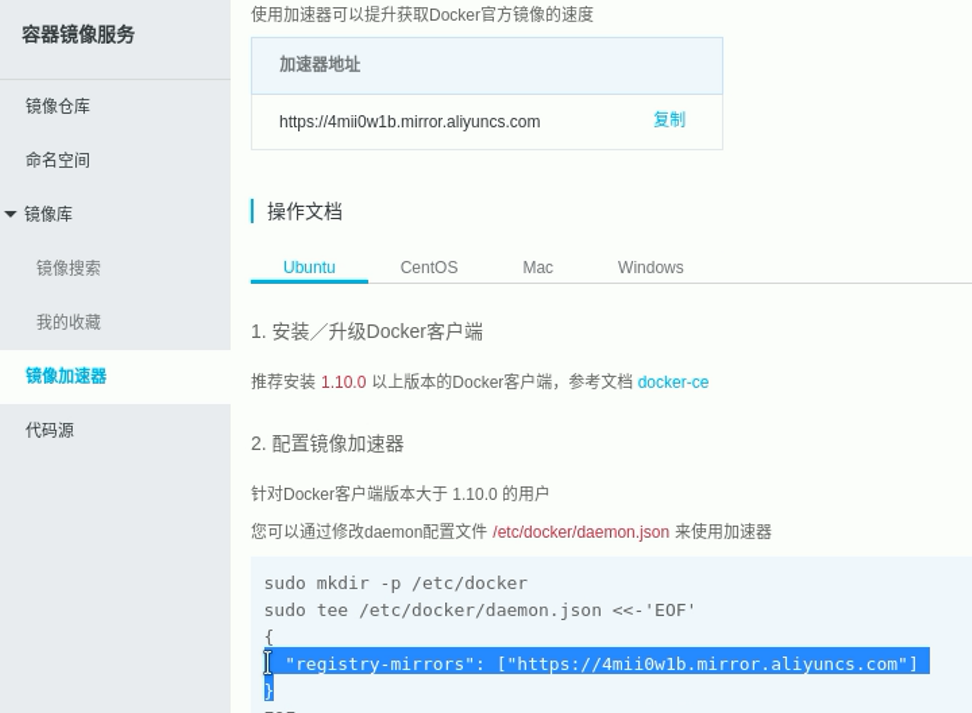

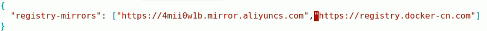

==重启生效==

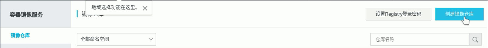

创建仓库

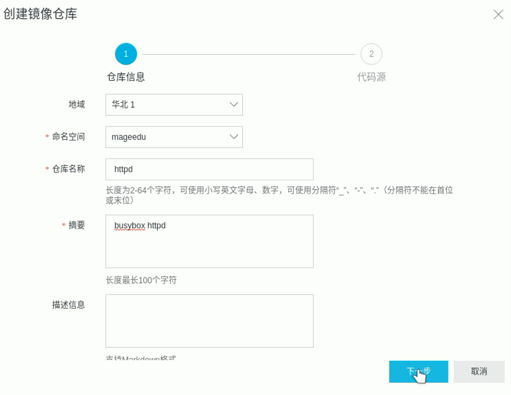

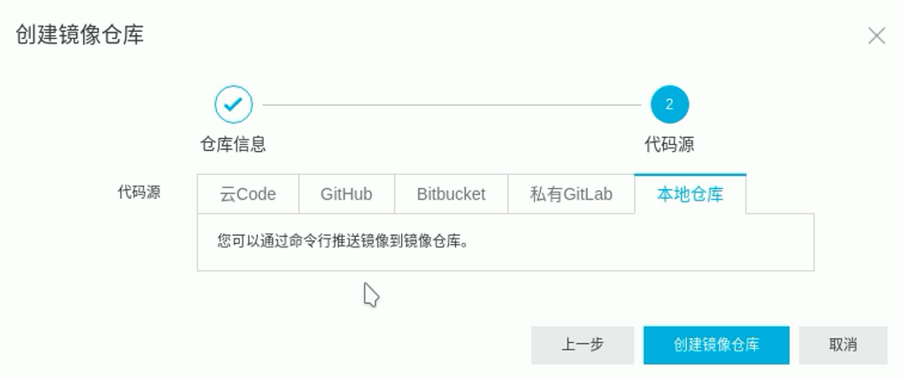

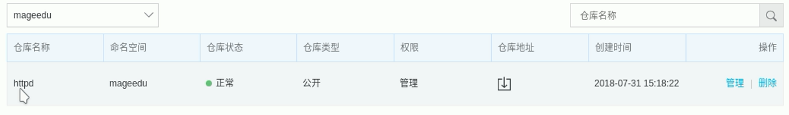

创建仓库成功，点击==管理==，获取服务器地址，用于设置本地镜像名

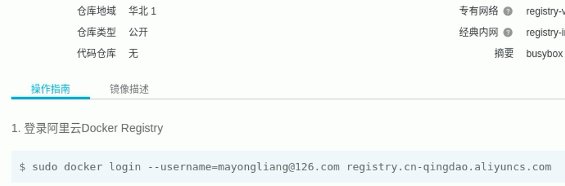

这个登录地址是选择的华北1对应的仓库地址

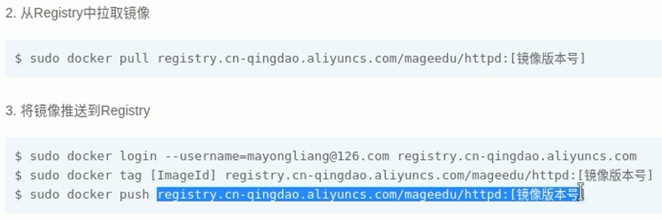

push时必须带上服务器地址，也就是==pageedu==前面的registry.cn-qingdao.aliyuncs.com，使用时直接粘贴复制就可以了

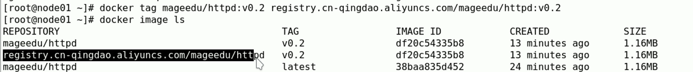

可以看到圈选的镜像名，到时候只能推送这个镜像

**tips**

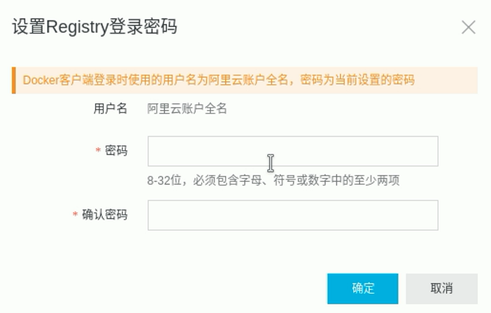

aliyun的registry有自己独有的密码，和登录aliyun的账号密码不是一个

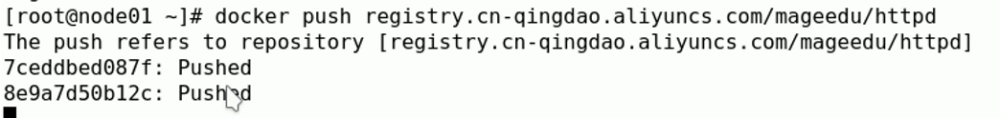

实际推送命令，可以看到和上面说的是一样的，这里要说明的是，实际上这次并**没有重启docker**，但是仍然能够使用，所以镜像加速并不是推送镜像所必须的一步

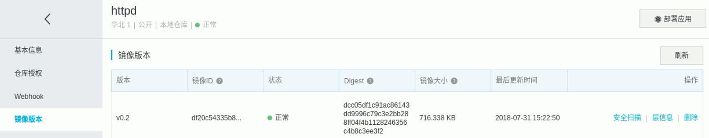

查看镜像信息，这里的安全扫描是为了避免私人用户的镜像带有一些问题，所以尽量别用别人的镜像

## 4.4本地保存和加载镜像save，load

save用于打包保存镜像文件，load用于加载打包的镜像，用于两台主机之间的私传，不需要向push，pull一样上传下载配置服务器镜像仓库

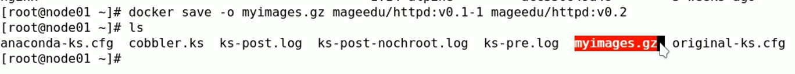

```shell
# 查看打包指令
[cobla@coblahouse ~]$ sudo docker image save --help

Usage:  docker image save [OPTIONS] IMAGE [IMAGE...]

Save one or more images to a tar archive (streamed to STDOUT by default)

Options:
  -o, --output string   Write to a file, instead of STDOUT
```

```shell
# 打包多个镜像到一个output.gz文件中，使用-o参数，注意是字母小o，不是大O或者0
[cobla@coblahouse ~]$ sudo docker image save -o output.gz cobla/bus_info:v0.0.2 cobla/bus_info:v0.0.1-1 
[cobla@coblahouse ~]$ ls
cap  output.gz  pycharm-professional-5.0.6.tar.gz  scripts  socket_server_1.py
```

### 4.4.*补充小技巧，远程推送docker-ce

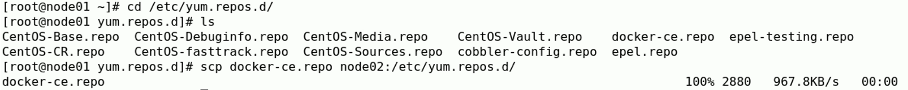

```shell
[cobla@coblahouse ~]$ cd /etc/yum.repos.d/
[cobla@coblahouse yum.repos.d]$ ls
docker-ce.repo # 找到docker-ce.repo
# 然后scp docker-ce.repo 目标主机名:目标主机保存根目录地址
# 对方接收后安装即可
```

